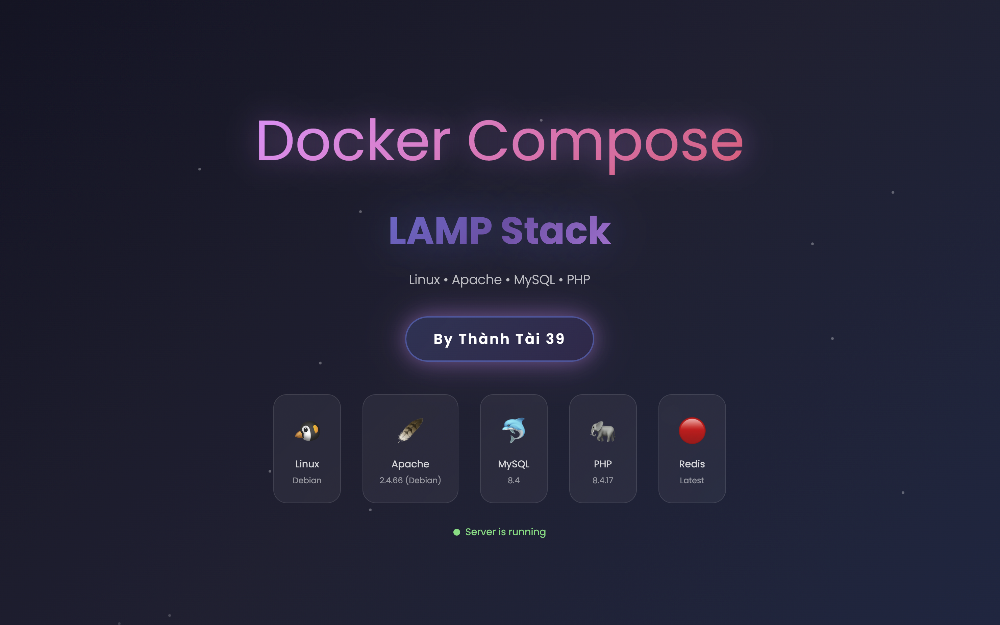
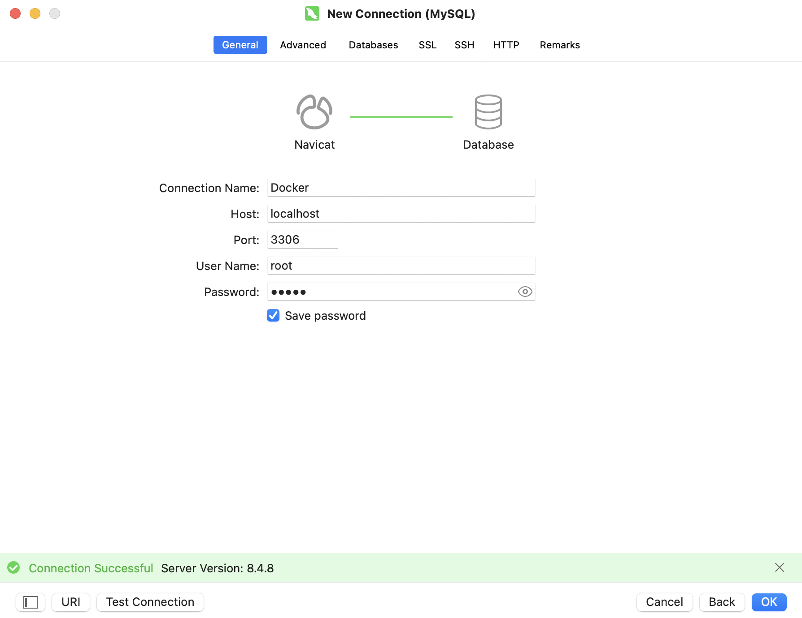

# Docker Compose LAMP (Apache + PHP + MySQL + phpMyAdmin + Redis)



Tài liệu này hướng dẫn **cách cài đặt, cấu hình và sử dụng** môi trường LAMP sử dụng Docker Compose, dựa trên cấu hình thực tế trong `sample.env` và `.env`.

---

## 📌 Giới thiệu

Stack bao gồm:

- **Apache + PHP** (chạy website)
- **MySQL 8** (database)
- **phpMyAdmin** (quản lý database)
- **Redis** (cache)

Toàn bộ hệ thống chạy bằng **Docker Compose**, phù hợp cho **môi trường phát triển (local/dev)**.

---

## 📂 Cấu trúc file môi trường

- **`sample.env`**
  File mẫu (template), dùng để tham khảo và copy cho lần cài đặt mới.

- **`.env`**
  File cấu hình **thực tế** mà Docker Compose sử dụng khi chạy.

> ⚠️ Docker **chỉ đọc file `.env`**, không đọc `sample.env`.

---

## 🚀 Hướng dẫn cài đặt & chạy project

### Clone and run docker

```bash
git clone https://github.com/ThanhTai39/Docker_Compose.git
cd Docker_Compose/
cp sample.env .env
copy sample.env .env
docker compose up -d
```

```bash
cd Docker_Compose/
docker compose up -d
```

### 1️⃣ Clone source code

```bash
git clone https://github.com/ThanhTai39/Docker_Compose.git
cd Docker_Compose/
```

---

### 2️⃣ Tạo file cấu hình môi trường

Copy file mẫu sang file cấu hình thực tế (cp: Linux / macOS, copy: Windows):

```bash
copy sample.env .env
cp sample.env .env
```

Sau đó **mở file `.env` và chỉnh sửa lại cho phù hợp** (port, password, v.v.).

---

### 3️⃣ Khởi động hệ thống

```bash
docker compose up -d
```

Docker sẽ tự động:

- Tạo network
- Khởi động MySQL, Redis
- Khởi động Apache + PHP
- Khởi động phpMyAdmin

---

### 4️⃣ Truy cập các dịch vụ

🌐 **Website**
👉 [http://localhost:9999](http://localhost:9999)

🗄 **phpMyAdmin**
👉 [http://localhost:9998](http://localhost:9998)

---

## 🔑 Thông tin đăng nhập MySQL (theo `.env` hiện tại)

### Kết nối từ phpMyAdmin / Navicat

- **Host**: `localhost`
- **Port**: `3306`
- **User**: `docker` (khuyên dùng)
- **Password**: `docker`
- **Database**: `docker`

### Đăng nhập bằng `root` (Kết nối Navicat):

- **Connecttion Name**: `Docker`
- **Host**: `localhost`
- **Port**: `3306`
- **User Name**: `root`
- **Password**: `taint39`

### Lưu ý: Phải bấm "Test Connection" => "Connection Successful" => xong bấm "OK"

## 🖼 Minh hoạ kết nối Navicat



---

## ▶️ Lệnh sử dụng thường ngày

### 🔹 Bật hệ thống

```bash
docker compose up -d
```

### 🔹 Tắt hệ thống

```bash
docker compose down
```

> 💡 Khuyên dùng **luôn bật/tắt bằng Docker Compose**, không bật lẻ từng container.

---

## 🧠 Lưu ý quan trọng

- Không commit file `.env` lên Git (nên có trong `.gitignore`).
- `sample.env` chỉ mang tính **hướng dẫn**, không ảnh hưởng đến việc chạy Docker.
- Nếu đổi port hoặc mật khẩu → chỉ cần sửa `.env` rồi chạy lại:

```bash
docker compose up -d
```

---

## ✅ Quy trình chuẩn khi cài trên máy mới

```text
Clone repo
↓
cp sample.env .env
↓
Sửa file .env cho phù hợp
↓
docker compose up -d
↓
Mở trình duyệt và sử dụng
```

---

🎉 Được custom bởi Thành Tài, sử dụng môi trường LAMP với Docker Compose.
